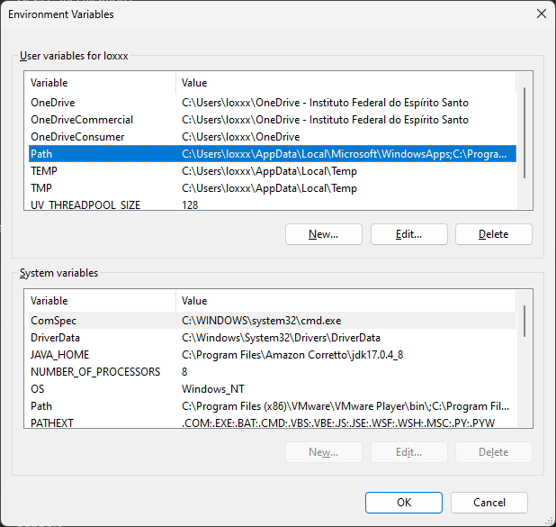

# Laboratório de Preparação de Ambiente Virtualizado com Terraform e VirtualBox (Continuação)

## Expansão da Infraestrutura de Rede

Nesta parte do laboratório, vamos expandir a infraestrutura de rede configurada anteriormente. Iremos criar uma rede local mais complexa, composta por 4 hosts clientes utilizando uma outra distribuição de Linux mais leve, chamada [Alpine Linux](https://www.alpinelinux.org/ "Alpine Linux"), conectados pela rede interna do VirtualBox. A rede usará o endereço IP 192.168.10.0/24.

### Pré-requisitos

Certifique-se de que o ambiente do laboratório anterior esteja funcionando corretamente antes de continuar. Além disso, verifique se você tem espaço de endereço disponível na rede 192.168.10.0/24 e que a configuração de rede do VirtualBox está adequada.

1.  Clone (1.1) __OU__ atualize (1.2) o repositório da disciplina:
    1.1. __Caso não tenha clonado o repositório anteriormente__: 
    Clone este repositório em seu ambiente local utilizando o seguinte comando:

    ```cmd
    git clone https://github.com/ifes-col/sri.git
    ```

    1.2. __Atualizando um repositório já clonado__:
    Mude para o diretório atual do repositório da disciplina e atualize-o usando os seguintes comandos:

    ```cmd
    cd <diretório_do_git_da_disciplina>
    git pull
    ```
    
> **Note**
> Você deve substituir '<diretório_do_git_da_disciplina>' pelo caminho completo onde o GitHub da disciplina foi baixado previamente.


2. Acesse o diretório do laboratório:
```cmd
cd sri/lab-02
```

3. Corrigindo o caminho (path) do executável do VirtualBox e do Terraform, para que possam ser executados a partir de qualquer diretório:

Usando Windows PowerShell ou Terminal Preview:
```cmd
$env:PATH = $env:PATH + ";C:\Program Files\Oracle\VirtualBox;<caminho_de_instalacao_do_terraform>;"
```

Usando o prompt de comando (CMD):
```cmd
set PATH = %PATH%;C:\Program Files\Oracle\VirtualBox;<caminho_de_instalacao_do_terraform>;
```

Usando a interface gráfica do Windows, pressione `Win+R`:
```cmd
rundll32 sysdm.cpl,EditEnvironmentVariables
```

Edite a variável `Path` do usuário conforme figura abaixo, acrescentando `C:\Program Files\Oracle\VirtualBox` e o <caminho_de_instalacao_do_terraform>:


> **Note**
> Você deve substituir '<caminho_de_instalacao_do_terraform>' pelo caminho completo onde o executável do Terraform foi extraído/instalado.


4. Visualize as alterações que serão realizadas no ambiente antes de aplicá-las:

```cmd
terraform plan
```


5. Crie as máquinas virtuais e recursos locais especificados no arquivo de configuração do Terraform:
```cmd
terraform apply
```

Ao final do processo, você terá um ambiente virtualizado configurado conforme as especificações do arquivo `main.tf`, utilizando o VirtualBox como provedor. 

Para acessar a máquina virtual recém criada, basta utilizar as seguintes credenciais:
```cmd
login: vagrant
password: vagrant
```

## Limpando o Ambiente

Lembre-se de que as máquinas virtuais criadas localmente podem ocupar recursos do seu sistema. Após concluir o laboratório, lembre-se de desligar e destruir as máquinas virtuais e recursos criados para liberar os recursos do sistema:

```cmd
terraform destroy
```